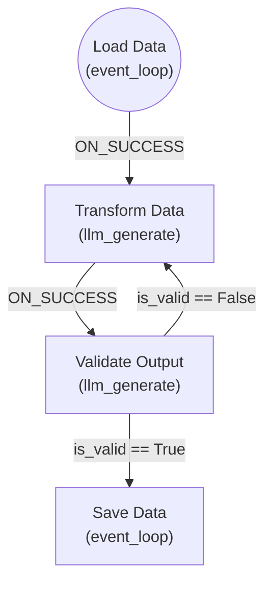

# Framework Debugging Tools

Comprehensive debugging utilities for Hive agent development.

## Overview

The debugging module provides four main components:

1. **AgentDebugger** - Interactive step-through execution with breakpoints
2. **NodeInspector** - Node input/output and state inspection
3. **ToolCallTracer** - Tool call tracing with detailed timing
4. **GraphVisualizer** - Graph structure and execution path visualization

## Quick Start

```python
from framework.debug import AgentDebugger, NodeInspector, ToolCallTracer, GraphVisualizer
from framework.runtime.core import Runtime

# Create your agent runtime
runtime = Runtime(graph=my_graph, goal=my_goal, llm_provider=provider)

# Set up debugging
debugger = AgentDebugger(runtime, interactive=True)
debugger.set_breakpoint("process-data", BreakpointType.NODE_ENTER)

# Run with debugging
result = await debugger.run_with_debugging(context)
```

## Components

### 1. AgentDebugger

Interactive debugger with breakpoints and step-through execution.

#### Features
- Set breakpoints on nodes, edges, tool calls, or errors
- Step through execution one node at a time
- Pause and inspect state at any point
- Continue execution to next breakpoint
- Interactive mode with command prompt

#### Usage

```python
from framework.debug import AgentDebugger, BreakpointType

# Initialize debugger
debugger = AgentDebugger(runtime, interactive=True)

# Set breakpoints
debugger.set_breakpoint("transform-data", BreakpointType.NODE_ENTER)
debugger.set_breakpoint("validate-output", BreakpointType.NODE_EXIT)
debugger.set_breakpoint("web_search", BreakpointType.TOOL_CALL)

# Run with debugging
result = await debugger.run_with_debugging({"input": "data"})

# Get trace history
history = debugger.get_trace_history()
```

#### Breakpoint Types

- `NODE_ENTER` - Break when entering a node
- `NODE_EXIT` - Break when exiting a node
- `EDGE_TRAVERSE` - Break when traversing an edge
- `CONDITION_EVAL` - Break when evaluating a condition
- `TOOL_CALL` - Break before tool execution
- `ERROR` - Break on errors

#### Interactive Commands

When a breakpoint is hit in interactive mode:
- `c` - Continue execution to next breakpoint
- `s` - Step to next node (step mode)
- `i` - Inspect current state
- `q` - Quit debugging

---

### 2. NodeInspector

Inspect node inputs, outputs, and execution history.

#### Features
- View node configuration and metadata
- Inspect inputs from current context
- Inspect outputs produced by nodes
- Track execution history with timing
- Preview large values with truncation

#### Usage

```python
from framework.debug import NodeInspector

inspector = NodeInspector(graph)

# Inspect node configuration
node_info = inspector.inspect_node("transform-data")
# Returns: id, name, description, node_type, input_keys, output_keys, tools

# Inspect inputs
inputs = inspector.inspect_node_inputs("transform-data", context)
# Returns: {key: {value, type, size, status}}

# Inspect outputs
outputs = inspector.inspect_node_outputs("transform-data", context)

# Get execution history
history = inspector.get_execution_history("transform-data")
```

#### StateInspector

Capture and compare execution state snapshots.

```python
from framework.debug import StateInspector

state_inspector = StateInspector()

# Take snapshots
snapshot1 = state_inspector.take_snapshot(step=1, node_id="node1", context=ctx)
snapshot2 = state_inspector.take_snapshot(step=2, node_id="node2", context=ctx)

# Compare snapshots
diff = state_inspector.compare_snapshots(step1=1, step2=2)
# Returns: {added_keys, removed_keys, common_keys, step_diff}

# Format for display
print(state_inspector.format_snapshot(snapshot1))
```

---

### 3. ToolCallTracer

Trace tool calls with detailed timing and results.

#### Features
- Record all tool invocations
- Measure execution time per tool
- Track call stack depth
- Capture arguments, results, and errors
- Generate statistics by tool

#### Usage

```python
from framework.debug import ToolCallTracer

tracer = ToolCallTracer(enable_timing=True)

# Start a trace
trace = tracer.start_trace("execution-1")

# Record node enters
tracer.record_node_enter("load-data")

# Trace tool calls
tool_call = tracer.start_tool_call("web_search", {"query": "AI agents"})
# ... execute tool ...
tracer.end_tool_call(tool_call, result="search results", error=None)

# Record edge traversal
tracer.record_edge_traversal("edge-1", "node1", "node2", "ON_SUCCESS")

# End trace
completed_trace = tracer.end_trace()

# Get statistics
stats = tracer.get_tool_call_stats()
# Returns: {total_calls, successful, failed, tools_used, timing, by_tool}

# Format for display
print(tracer.format_trace(completed_trace))

# Export to JSON
trace_json = tracer.export_trace_json(completed_trace)
```

#### Tool Call Statistics

```python
{
    "total_calls": 10,
    "successful": 9,
    "failed": 1,
    "tools_used": ["web_search", "csv_read", "save_data"],
    "timing": {
        "total_ms": 2500.5,
        "average_ms": 250.05,
        "min_ms": 50.2,
        "max_ms": 800.3
    },
    "by_tool": {
        "web_search": {
            "count": 3,
            "success": 3,
            "failed": 0,
            "total_duration_ms": 1200.5
        }
    }
}
```

---

### 4. GraphVisualizer

Visualize graph structure and execution paths.

#### Features
- Render graphs in multiple formats (ASCII, Mermaid, DOT)
- Show node connectivity
- Find all possible execution paths
- Visualize actual execution paths
- Generate statistics on edge usage

#### Usage

```python
from framework.debug import GraphVisualizer, EdgeRouteVisualizer

# Graph structure visualization
visualizer = GraphVisualizer(graph)

# ASCII art rendering
print(visualizer.render_ascii())

# Mermaid diagram
mermaid = visualizer.render_mermaid()
# Copy to Markdown file for rendering

# Graphviz DOT format
dot = visualizer.render_dot()
# Use with Graphviz tools

# Node connectivity
connectivity = visualizer.get_node_connectivity("transform-data")
# Returns: {incoming_edges, outgoing_edges, is_entry_point, is_terminal}

# Find all possible paths
paths = visualizer.find_execution_paths(max_depth=10)
# Returns: [[node1, node2, node3], [node1, node4, node5]]
```

#### Edge Routing Visualization

```python
edge_visualizer = EdgeRouteVisualizer(graph)

# Record routing decisions
edge_visualizer.record_traversal(
    edge_id="edge-1",
    context=current_context,
    reason="Condition evaluated to True",
    skipped_edges=["edge-2", "edge-3"]
)

# Visualize specific decision
print(edge_visualizer.visualize_routing_decision(step=3))

# Visualize execution path
print(edge_visualizer.visualize_execution_path(["node1", "node2", "node3"]))

# Get usage statistics
stats = edge_visualizer.get_edge_usage_stats()
# Returns: {total_traversals, unique_edges_used, edge_counts, most_used_edge}
```

## Complete Example

```python
from framework.debug import (
    AgentDebugger,
    NodeInspector,
    ToolCallTracer,
    GraphVisualizer,
    BreakpointType,
)
from framework.runtime.core import Runtime

# Set up agent
runtime = Runtime(graph=my_graph, goal=my_goal, llm_provider=provider)

# 1. Visualize graph structure
visualizer = GraphVisualizer(my_graph)
print(visualizer.render_ascii())
mermaid_diagram = visualizer.render_mermaid()

# 2. Set up debugging
debugger = AgentDebugger(runtime, interactive=False)
debugger.set_breakpoint("critical-node", BreakpointType.NODE_ENTER)

# 3. Set up inspection
inspector = NodeInspector(my_graph)

# 4. Set up tracing
tracer = ToolCallTracer(enable_timing=True)
tracer.start_trace("debug-run-1")

# 5. Run with debugging
context = {"input": "test data"}

# Before execution
print("Graph paths:", visualizer.find_execution_paths())

# Execute
result = await debugger.run_with_debugging(context)

# After execution
trace = tracer.end_trace()
print(tracer.format_trace(trace))
print("\nTool call stats:", tracer.get_tool_call_stats())

# Inspect specific nodes
for node_id in ["node1", "node2"]:
    inputs = inspector.inspect_node_inputs(node_id, result)
    outputs = inspector.inspect_node_outputs(node_id, result)
    print(f"\n{node_id}:")
    print(f"  Inputs: {inputs}")
    print(f"  Outputs: {outputs}")
```

## Output Formats

### ASCII Graph

```
======================================================================
GRAPH STRUCTURE
======================================================================

Entry point: load-data
Nodes: 4
Edges: 4

----------------------------------------------------------------------

┌─ load-data
│  Name: Load Data
│  Type: event_loop
│  Outgoing edges:
│    → transform-data (via load-to-transform, ON_SUCCESS)
└────────────────────────────────────────────────────────────────────
```

### Mermaid Diagram



### Execution Trace

```
======================================================================
EXECUTION TRACE: execution-1
======================================================================
Duration: 2500.50ms

Node Sequence (4 nodes):
  1. load-data
  2. transform-data
  3. validate-output
  4. save-data

Tool Calls (5 calls):
  ✅ csv_read (150.25ms)
     Args: {'file_path': 'data.csv'}
     Result: DataFrame with 100 rows

  ✅ save_data (200.10ms)
     Args: {'data': [...], 'path': 'output.csv'}
     Result: Saved successfully

Edge Traversals (4 edges):
  load-data → transform-data (via load-to-transform)
  transform-data → validate-output (via transform-to-validate)
  validate-output → save-data (via validate-to-save)
======================================================================
```

## Integration with Runtime

The debugging tools are designed to integrate with the Hive Runtime. For full integration:

1. **Hook into Runtime events**: Listen for node enters, exits, tool calls
2. **Inject debugger callbacks**: Pause execution at breakpoints
3. **Capture state snapshots**: Record context at each step
4. **Trace tool calls**: Wrap tool execution with timing

```python
# Example integration (simplified)
class DebugRuntime(Runtime):
    def __init__(self, *args, debugger=None, **kwargs):
        super().__init__(*args, **kwargs)
        self.debugger = debugger

    async def execute_node(self, node_id, context):
        if self.debugger:
            # Check breakpoint
            if self.debugger._should_break(BreakpointType.NODE_ENTER, node_id, context):
                await self.debugger._pause_at_breakpoint(...)

        # Execute node
        result = await super().execute_node(node_id, context)

        if self.debugger:
            # Record execution
            self.debugger.state.current_node = node_id
            self.debugger.state.step_count += 1

        return result
```

## Best Practices

1. **Use interactive mode for development**: Step through execution to understand agent behavior
2. **Set conditional breakpoints**: Break only when specific conditions are met
3. **Trace tool calls in production**: Identify performance bottlenecks
4. **Visualize before building**: Generate graph diagrams to plan agent structure
5. **Compare snapshots**: Understand how context changes between nodes
6. **Export traces**: Save execution traces for later analysis

## Limitations

- **Interactive mode**: Requires terminal input, not suitable for production
- **Performance overhead**: Tracing and inspection add execution time
- **Memory usage**: Large traces can consume significant memory
- **Thread safety**: Not designed for concurrent execution debugging

## Future Enhancements

- [ ] Web-based debugging UI
- [ ] Breakpoint conditions with full expression support
- [ ] Timeline view of execution
- [ ] Diff view for context changes
- [ ] Export traces to standard formats (OpenTelemetry, Jaeger)
- [ ] Integration with IDE debuggers
- [ ] Replay execution from traces
